# ICTPRG302 Introduction to Programming (Python)

## Using VSCode to Replace Idle

---
layout: two-cols
---

# Python Puzzles to Practice With #1

::left::

## Setting-up VSCode for Python

::right::

## Requirements

- Python is installed
- VSCode is installed

---
layout: section
---

# Setting VSCode up for Python

---
level: 2
---

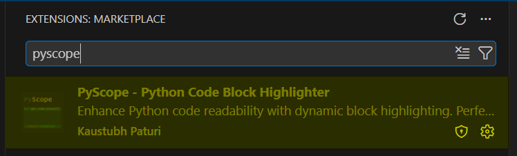
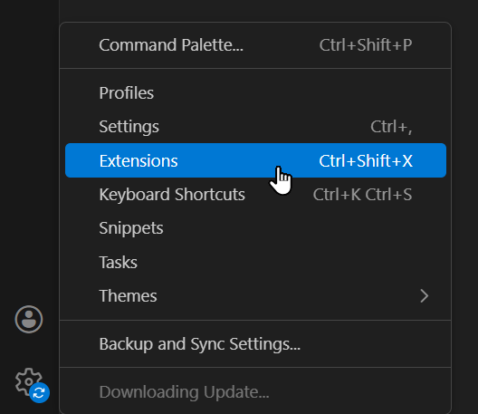
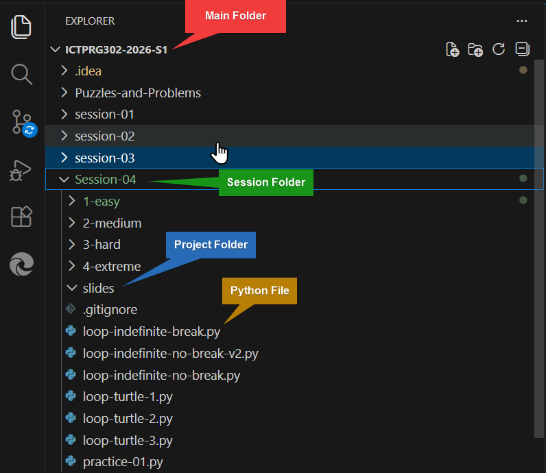
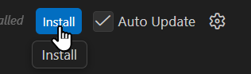
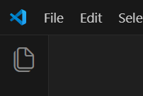
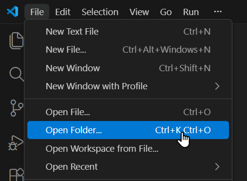
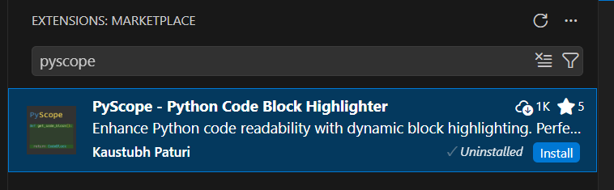
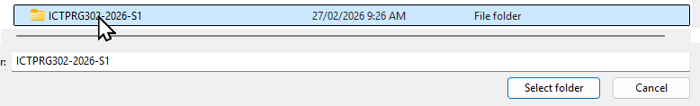
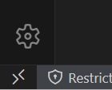
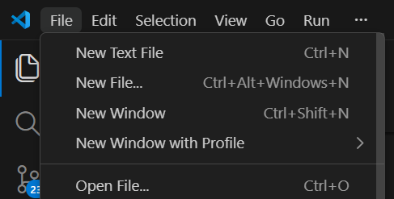
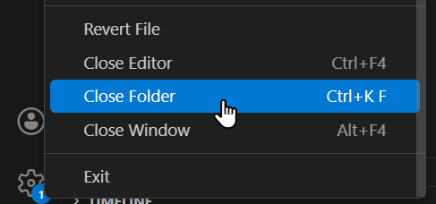
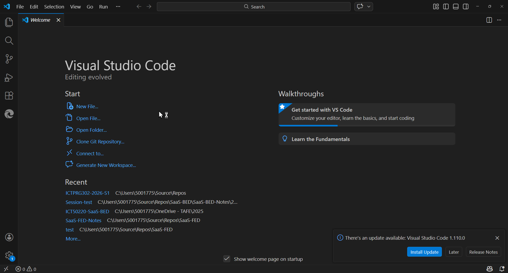

---
layout: end
---

# That's All Folks!

## Now, go forth and `CODE`!
